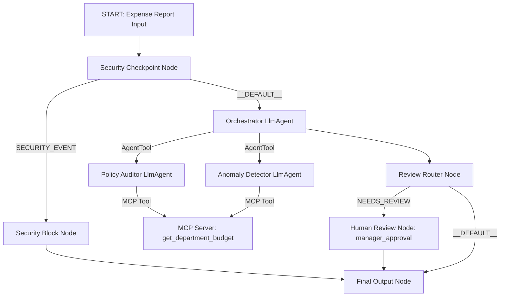
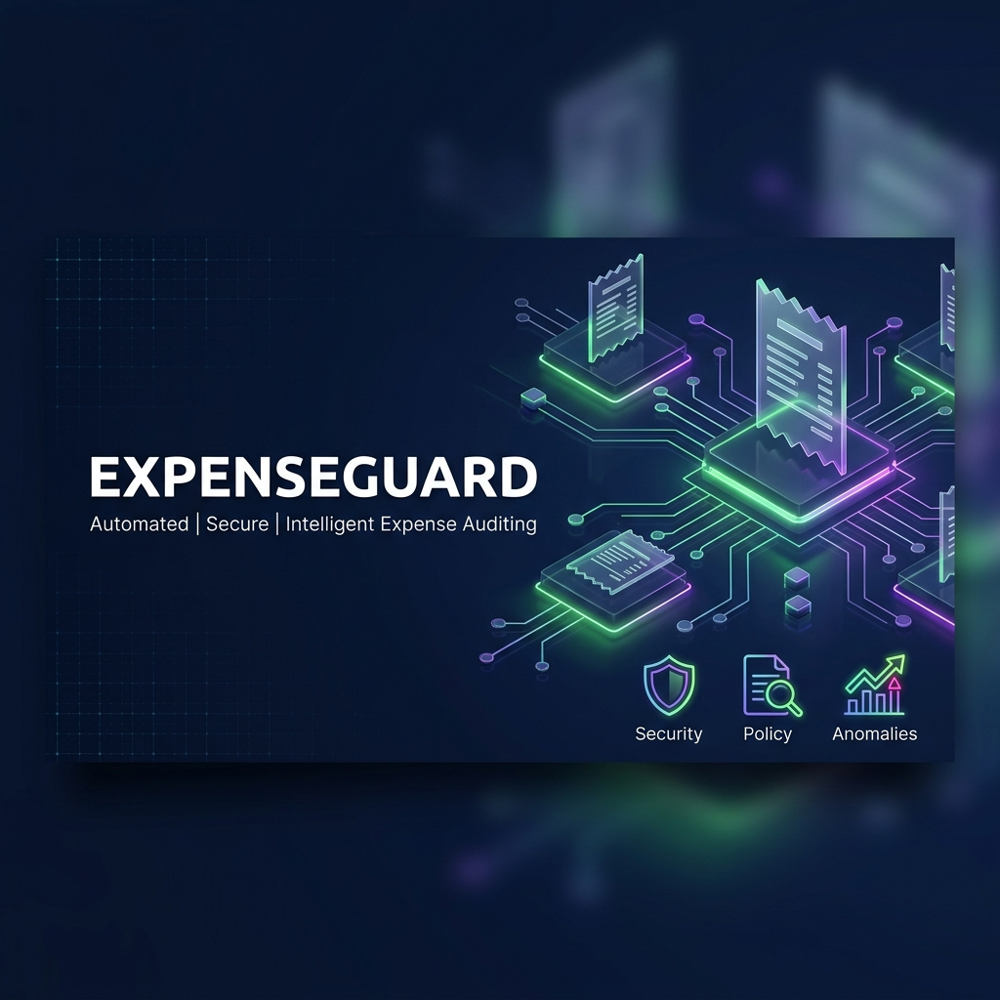
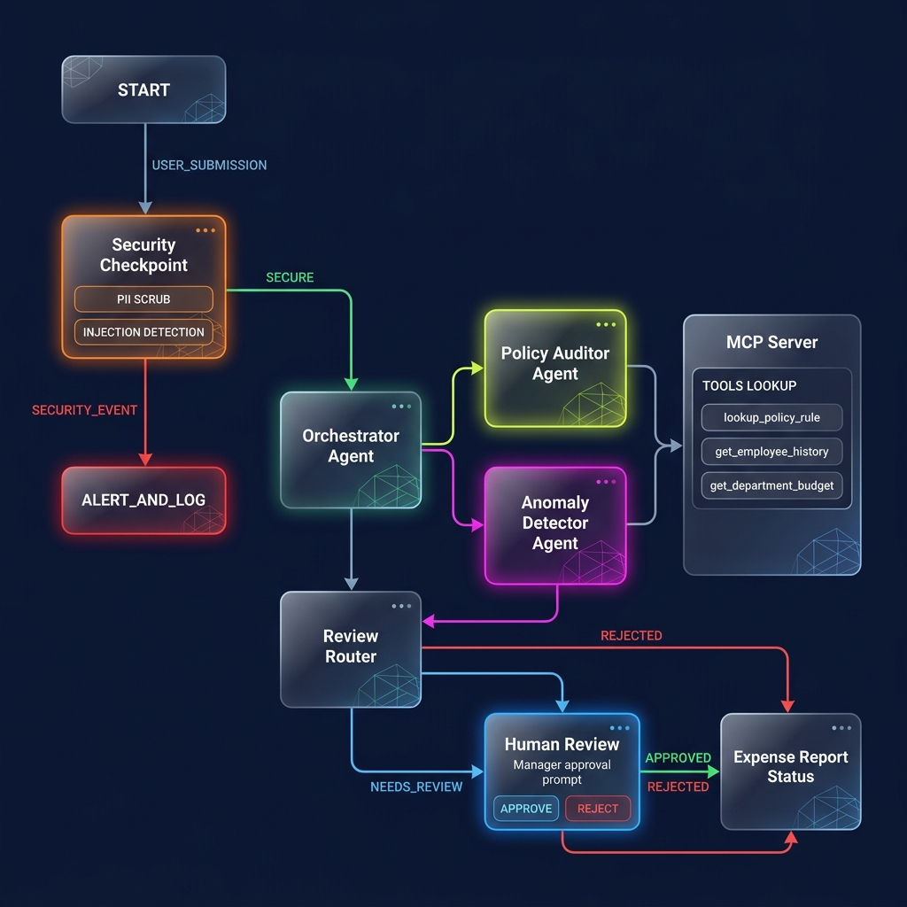

# ExpenseGuard

Intelligent business expense report auditing, policy compliance validation, and anomaly detection using the Google Agent Development Kit (ADK).

## Prerequisites
* Python 3.11+
* [uv](https://docs.astral.sh/uv/) (Astral's fast Python package installer)
* Gemini API Key from [AI Studio](https://aistudio.google.com/apikey)

## Quick Start
```bash
git clone <repo-url>
cd expense-guard
cp .env.example .env   # Add your GOOGLE_API_KEY
make install
make playground        # Opens UI at http://localhost:18081
```

## Architecture
This agent utilizes a multi-agent workflow orchestrated by an ADK 2.0 Graph Workflow:



## How to Run
* **make playground** — Runs the interactive playground UI at [http://localhost:18081](http://localhost:18081) for testing.
* **make run** — Runs the local web server endpoint mode on port 8080.
* **make test** — Runs the pytest test suite.

## Sample Test Cases
You can test the agent in the playground UI using the following scenarios:

### Test Case 1: Policy Limit Block
* **Input**:
  ```json
  {
    "employee_name": "Jane Doe",
    "amount": 12000.00,
    "category": "Meals",
    "description": "Team celebration dinner"
  }
  ```
* **Expected Flow**: Immediately intercepted by the Security Checkpoint node because the amount exceeds the $10,000 threshold. It bypasses the Orchestrator and specialists entirely.
* **Check**: The UI outputs: *"ExpenseGuard Blocked Action: Policy Violation: Individual expenses exceeding $10,000 are not permitted."*

### Test Case 2: Auto-Approved Flow
* **Input**:
  ```json
  {
    "employee_name": "John Miller",
    "amount": 45.00,
    "category": "Meals",
    "description": "Client lunch with Acme Corp representatives"
  }
  ```
* **Expected Flow**: Passes Security Checkpoint. Orchestrator calls the `policy_auditor` (which fetches Meals rules) and `anomaly_detector` (checks Engineering budget). Both approve, Orchestrator outputs `DECISION: APPROVED`, and it goes straight to the final output.
* **Check**: UI outputs: *"ExpenseGuard Final Result: DECISION: APPROVED"* with a detailed audit description.

### Test Case 3: Human-in-the-Loop Review
* **Input**:
  ```json
  {
    "employee_name": "Viola Smith",
    "amount": 750.00,
    "category": "Software",
    "description": "Yearly subscription for design software tools"
  }
  ```
* **Expected Flow**: Passes Security Checkpoint. Auditor fetches history via MCP and flags that employee Viola has recurring violations. Orchestrator recommends `NEEDS_REVIEW`. Review Router redirects to the `human_review` node, prompting a manual decision.
* **Check**: The UI halts and shows a prompt asking: *"Approve or Reject? (Type 'Approve' or 'Reject')"*. Typing *"Approve"* resumes the execution to output: *"Manager Approved..."*

## Demo Script
A spoken presentation guide is available in [DEMO_SCRIPT.txt](file:///Users/s.meghashyam/Desktop/adk-workspace/expense-guard/DEMO_SCRIPT.txt).

## Troubleshooting
1. **API Key 404/Authentication Failures**: Ensure you set a live model like `gemini-2.5-flash` in `.env`. Ensure your API key in `.env` is correct and doesn't contain bracket characters `<` and `>`.
2. **"No agents found" / Port in use**: Run `make playground` again. If port 18081 or 8090 is in use, kill the processes holding them:
   `lsof -t -i :18081,8090 | xargs kill -9` (macOS/Linux)
3. **Changes in code not reflecting**: `adk web` watches files but on some platforms hot-reload doesn't cleanly refresh background subprocesses like the MCP server. Fully terminate the server (Ctrl+C) and run `make playground` again to reload fresh code.

## Push to GitHub

1. Create a new repo at https://github.com/new
   - Name: expense-guard
   - Visibility: Public or Private
   - Do NOT initialize with README (you already have one)

2. In your terminal, navigate into your project folder:
   ```bash
   cd expense-guard
   git init
   git add .
   git commit -m "Initial commit: expense-guard ADK agent"
   git branch -M main
   git remote add origin https://github.com/<your-username>/expense-guard.git
   git push -u origin main
   ```

3. Verify .gitignore includes:
   ```
   .env          ← your API key — must NEVER be pushed
   .venv/
   __pycache__/
   *.pyc
   .adk/
   ```

⚠ NEVER push `.env` to GitHub. Your API key will be exposed publicly.

## Assets

### Cover Banner


### Agent Workflow Diagram


