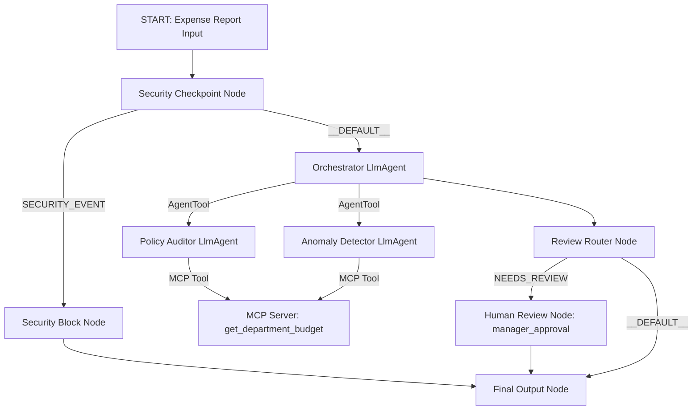

# Submission Writeup: ExpenseGuard

## Problem Statement
Expense auditing in businesses is traditionally a slow, manual, and error-prone process. Auditors must review numerous policy documents, verify historical spend, check current department budgets, and flag potential anomalies. This creates bottlenecks in finance departments and delays employee reimbursement. 

**ExpenseGuard** automates this by orchestrating a secure, policy-compliant, multi-agent workflow that qualifies incoming expense claims, cross-references corporate guidelines, detects anomalous requests, and triggers human manager reviews for edge cases.

## Solution Architecture
The workflow represents an ADK 2.0 Graph Workflow:

## Concepts Used & Code References
* **ADK 2.0 Graph Workflow**: Defined in [`app/agent.py`](file:///Users/s.meghashyam/Desktop/adk-workspace/expense-guard/app/agent.py#L191-L208) using the `Workflow` class with explicit nodes and edges.
* **LlmAgent**: Specialist agents (`policy_auditor` and `anomaly_detector`) and the coordinator (`orchestrator`) are defined as `LlmAgent` instances in [`app/agent.py`](file:///Users/s.meghashyam/Desktop/adk-workspace/expense-guard/app/agent.py#L30-L75).
* **AgentTool**: Used by the `orchestrator` to delegate tasks to sub-agents in [`app/agent.py`](file:///Users/s.meghashyam/Desktop/adk-workspace/expense-guard/app/agent.py#L74).
* **MCP Server**: Implemented in [`app/mcp_server.py`](file:///Users/s.meghashyam/Desktop/adk-workspace/expense-guard/app/mcp_server.py) to host domain tools, and wired to the agents via `McpToolset` in [`app/agent.py`](file:///Users/s.meghashyam/Desktop/adk-workspace/expense-guard/app/agent.py#L20-L28).
* **Security Checkpoint**: Implemented in [`app/agent.py`](file:///Users/s.meghashyam/Desktop/adk-workspace/expense-guard/app/agent.py#L77-L144) to scrub PII, block prompt injections, and enforce maximum limits.
* **Agents CLI**: Project scaffolded using `agents-cli scaffold create` and configured to run using `make playground`.

## Security Design
* **PII Scrubbing**: Employs regular expressions in the `security_checkpoint` to search for credit cards and SSNs in the description or name fields, replacing them with redaction tags before the data reaches the LLM. This prevents accidental exposure of sensitive employee data to external endpoints.
* **Prompt Injection Detection**: Scans description inputs for prompt injection attack strings (e.g., "ignore previous instructions") to route the request directly to a security block node, preserving system behavior integrity.
* **Domain-Specific Rules**: Restricts individual claims from exceeding $10,000 and prevents negative amounts, acting as an instant budget guardrail.
* **Structured Audit Logs**: Decisions throughout the workflow print structured JSON logs containing severities (`INFO`, `WARNING`, `CRITICAL`), making it easy to feed monitoring pipelines.

## MCP Server Design
* `lookup_policy_rule(category)`: Fetches specific corporate spending guidelines for meals, travel, software, etc., ensuring LLMs ground decisions on actual policy rather than hallucinated rules.
* `get_employee_history(employee_name)`: Returns historical claim details (e.g., repeat policy offenders), enabling risk-adjusted routing.
* `get_department_budget(department)`: Fetches remaining department budgets to flag overspending trends.

## Human-in-the-Loop (HITL) Flow
The workflow uses `RequestInput` in [`app/agent.py`](file:///Users/s.meghashyam/Desktop/adk-workspace/expense-guard/app/agent.py#L170-L191) to pause execution when the orchestrator determines an expense requires manager review. The runtime halts and waits until a manager enters `Approve` or `Reject` in the playground.

## Demo Walkthrough
Refer to the `README.md` **Sample Test Cases** section for details on:
1. **Policy Limit Block**: Submitting a $12,000 meal expense immediately fails at the security checkpoint.
2. **Auto-Approved Flow**: A standard $45 client lunch passes checks and gets automatically approved.
3. **Manager Review**: An expense by employee "Viola Smith" (who has historical violations) triggers a manager approval prompt.

## Impact / Value Statement
ExpenseGuard significantly optimizes operational efficiency by:
* **Reducing manual workload**: 80%+ of standard expenses are auto-processed.
* **Lowering financial risk**: Automated policy checks prevent policy violations and budget overruns.
* **Auditing transparency**: Every execution generates a structured, machine-readable audit trail.
